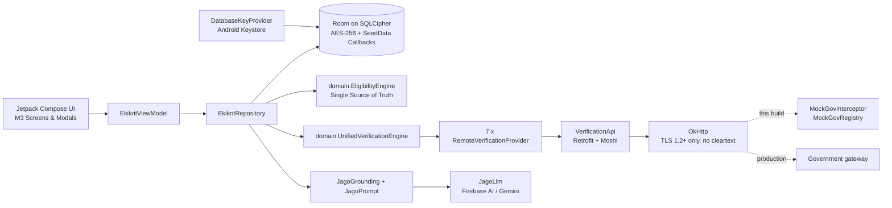

# Ekikrit

**One app for every scholarship a Scheduled Tribe student is entitled to.**

Ekikrit is a native Android prototype built for **Smart India Hackathon 2026, problem statement SIH26238**: a unified scholarship experience across the Ministry of Tribal Affairs schemes for Scheduled Tribe (ST) students, including PVTG communities. It brings discovery, eligibility, document reuse, multi-registry verification, application tracking and DBT payment visibility into a single mobile app, in English, Hindi, Odia and Gondi.

> **Prototype status.** The government registries (UIDAI, DigiLocker, APAAR, AISHE, UDISE+, UGC/NTA, e-District) are **simulated**. Every call goes through a real Retrofit/OkHttp client stack, but the responses come from an in-process mock gateway. See [What is real and what is simulated](#what-is-real-and-what-is-simulated).

---

## Why it exists

A student who qualifies for several schemes today faces separate portals, repeated document uploads, opaque application status, and no signal when data from two registries disagrees. Ekikrit's answer:

- **Discover once:** all five schemes in one place, with an eligibility result computed for the student's own profile.
- **Upload once:** documents are pulled from DigiLocker into a wallet and reused across schemes.
- **Verify together:** seven registries are cross-checked in one run.
- **Never punish a mismatch:** a discrepancy is routed to an officer, not turned into a rejection.
- **See everything:** stage timeline, audit trail and payment history in one view.

## Features

| Area | What it does |
|---|---|
| **Unified dashboard** | Active applications, pending actions, notifications and the best scheme match for the student. |
| **Five schemes** | Pre-Matric, Post-Matric, Top Class Education, National Fellowship (M.Phil/Ph.D) and National Overseas Scholarship, each with rules, ceilings and deadlines. |
| **Eligibility engine** | Scores a student against each scheme (status, match %, failed criteria, missing documents) and enforces the one-active-scholarship rule. |
| **DigiLocker wallet** | Connect, pull and reuse documents (Aadhaar, caste, income, marksheet, APAAR) across schemes. |
| **Seven-source verification** | UIDAI, DigiLocker, APAAR, AISHE, UDISE+, UGC/NTA and e-District, queried concurrently. |
| **Exception routing** | Income variance within the scheme ceiling becomes a **non-blocking** Reviewer Desk item. An unreachable registry becomes `PENDING` with an automatic retry, never a failure. |
| **Reviewer Desk** | Officer queue scoped to the disputed field: a case reference instead of the student's name, and category shown only when category is what is in dispute. |
| **Application tracking** | Six-stage timeline from Applied through Institute, State and Ministry review to Sanctioned and Disbursed. |
| **DBT payments** | Consolidated disbursement history per scheme. |
| **Unreached-beneficiary nudge** | Uses enrolment data to flag a scheme the student may qualify for but has not applied to. |
| **Audit trail** | Every action is logged with actor and timestamp. |
| **DPDP consent** | Consent dialog, purpose statement and a revoke/grant control, named after the DPDP Act 2023. |
| **Offline mode** | Applications are saved as drafts and synced when connectivity returns. |
| **Multilingual UI** | English, Hindi, Odia and Gondi. |
| **JAGO assistant** | In-app chatbot, described below. |

## JAGO, the assistant

JAGO answers questions about status, eligibility, documents, discrepancies and payments.

- **Gemini mode:** when the device is online, the student has given consent, and Firebase AI is configured, JAGO asks Gemini through **Firebase AI Logic**. The answer is grounded in the student's own records and written in the language selected in the app.
- **Built-in mode:** offline, without consent, without Firebase configuration, or if the model call fails or times out (15 s), JAGO falls back to its rule-based answers. Those fallback answers are English only. A failed model call is announced with a short notice.

What is sent to the model is an allow-listed, de-identified summary: academic level, scheme names and stages, eligibility outcomes, document types and status, payment amounts and dates, and which verification checks are open. It never includes the student's name, mobile number, date of birth, Aadhaar, bank or IFSC details, APAAR or institution IDs, exact income, or the values inside a verification mismatch. Free text is additionally stripped of long numbers and masked identifiers. Earlier chat turns are forwarded only if they are the student's own messages or previous AI replies. Tests in `JagoGroundingTest` enforce this contract.

The prompt tells the model to use only the supplied facts, treat eligibility and stage as authoritative, never request Aadhaar/OTP/bank details, and ignore instructions embedded in the student's message.

> Gondi is a low-resource language. Gemini replies in Gondi are best-effort (Devanagari script, with a Hindi fallback), so review them with native speakers before relying on them.

## Architecture



**Layers**

- `ui/`: Compose screens and modals, plus `EkikritViewModel`.
- `data/repository/`: Single source of truth for active student, applications, documents, payments, review queue and JAGO.
- `data/local/`: Room database, DAOs, automated lifecycle `SeedData` population and Keystore-backed key provider.
- `data/remote/`: Verification gateway client (`VerificationApi`, `VerificationGateway`) and mock interceptor (`MockGovInterceptor`).
- `data/ai/`: `JagoLlm` interface and Gemini/built-in rule-based implementations.
- `domain/`: `EligibilityEngine`, `UnifiedVerificationEngine`, and JAGO prompt and grounding sanitizers. Pure Kotlin, tested on JVM.

## What is real and what is simulated

| Component | Status |
|---|---|
| Room database, encrypted at rest with SQLCipher (AES-256), passphrase wrapped by an Android Keystore key | **Real** |
| Aadhaar and bank details masked on storage and display | **Real** |
| Verification client stack (Retrofit, Moshi, OkHttp, TLS 1.2+ only, cleartext refused) | **Real** |
| Government registry responses | **Simulated** by `MockGovInterceptor`. Six sources return `VERIFIED`; e-District returns a +11.9% income variance to demo exception routing. |
| DigiLocker connection and document pull | **Simulated** |
| Login | **Local only.** No real OTP or identity check. Firebase Auth dependencies are present but disabled. |
| Persona data (three demo students) | **Fictional seed data** |
| JAGO in Gemini mode | **Real** calls to Gemini once Firebase is configured; built-in mode needs no network |

**Going live with a real gateway:** `VerificationGateway.createApi(baseUrl = "https://<gateway>/", interceptors = emptyList())`. The `VerificationApi` contract, request minimisation (`subjectRef` is an internal ID, never Aadhaar) and PENDING-on-failure behaviour stay as they are. Consider adding a `CertificatePinner` for that host.

## Security and privacy

- **At rest:** the Room database uses SQLCipher. A random 256-bit passphrase is stored only in wrapped form (AES-GCM under a non-exportable Android Keystore key). If the wrapped key cannot be recovered, the unreadable database is deleted and re-seeded.
- **Backups:** `allowBackup=false`, plus explicit cloud-backup and device-transfer exclusions.
- **Transport:** `network_security_config` blocks cleartext, and the gateway client accepts `RESTRICTED_TLS` only (TLS 1.2+ with modern suites; TLS 1.3 is not forced because it needs API 29+ and the app supports API 24+).
- **Data minimisation:** verification requests carry only the fields a given registry needs; JAGO sends only the de-identified summary above.
- **Consent:** third-party AI processing is skipped entirely when the student has revoked consent, and the consent dialog discloses it as a purpose.
- **Least privilege:** only the `INTERNET` permission is requested; no storage, camera or location permissions.
- **Reviewer scoping:** the officer queue shows the disputed field, not the applicant's identity.

## Getting started

**Requirements:** Android Studio (recent stable), JDK 21, Android SDK 36. Minimum device API is 24.

```bash
git clone https://github.com/jhamanas/Ekikrit.git
cd Ekikrit
./gradlew assembleDebug        # build the debug APK
./gradlew installDebug         # install on a connected device or emulator
```

The app runs fully without any cloud setup. JAGO simply stays in built-in mode.

### Enable Gemini-backed JAGO

1. Create a Firebase project and register the Android app (`com.aistudio.ekikrit.tqvbld`).
2. Enable **Firebase AI Logic** with the **Gemini Developer API** backend.
3. Download `google-services.json` into `app/`.
4. Check that `JagoConfig.MODEL_NAME` (`data/ai/JagoLlm.kt`) is a model your project can use. Firebase retires older models, so update it when needed.
5. For anything beyond a demo, enable **App Check** so only your app can call the backend. No API key is compiled into the APK.

### Demo Personas & Roles

- **Birsa Munda Tirkey (`STU_2026_01`):** PVTG Birhor at NIT Rourkela, B.Tech CSE (Income: ₹2,10,000). Has an active Post-Matric application under non-blocking review (+11.9% e-District variance), cleared Pre-Matric historical grant, and Top Class scheme evaluation.
- **Sunita Soren (`STU_2026_02`):** ST Santhal at IIT Kharagpur, B.Tech Metallurgical Engineering (Income: ₹3,20,000). Sanctioned and disbursed Top Class Education Scholarship.
- **Jaipal Singh Munda (`STU_2026_03`):** ST Ho at Utkal University, M.Phil/Ph.D Tribal Studies (Income: ₹1,80,000). High-eligibility candidate for National Fellowship for ST (NFST) and National Overseas Scholarship (NOS).
- **Reviewing Officer (`REV_OFFICER_01`):** District Tribal Welfare Officer (Desk #4, Sundargarh, Odisha). Toggle via the single `demo_switcher_btn` in the top app bar to view and resolve active exceptions.

## Tests

```bash
./gradlew testDebugUnitTest             # JVM unit and integration tests (33 tests)
./gradlew assembleDebug                 # compile debug APK
```

| Suite | Description & Coverage |
|---|---|
| `EkikritFinalValidationTest` | Room database callback seeding, unique index integrity, identity isolation, reviewer clearance |
| `EkikritVerificationAndReviewerTest` | Production `EkikritRepository` and `UnifiedVerificationEngine` end-to-end exception generation and resolution |
| `EkikritEligibilityAndOwnershipTest` | Domain `EligibilityEngine` rules, statutory income ceilings, and multi-tenant student isolation |
| `UnifiedVerificationTest` | Concurrent 7-registry verification rail execution and exception handling |
| `EligibilityEngineTest` | Scheme eligibility scoring, missing document checks, and single-scholarship conflict rules |
| `JagoGroundingTest` | PII sanitization, Aadhaar/bank masking, language prompting, and context grounding |
| `VerificationGatewayTest` | Gateway models, mock interceptor network responses, and PENDING resilience |

## Continuous integration

`.github/workflows/android.yml` runs unit tests and builds debug and release APKs on every push and pull request to `main`.

## Known limitations

- Registries and DigiLocker are simulated; login is local.
- CI release builds are signed with a generated debug keystore and are not Play Store ready.
- `fallbackToDestructiveMigration()` is still enabled, so a schema bump wipes local data. Add real migrations before shipping.
- Some `EligibilityEngine` checks use loose string matching (for example on the ST category). Tighten them before relying on the results.
- Built-in JAGO answers are English only.
- Enabling encryption deletes any database created by an earlier, unencrypted build.

## Roadmap

- Replace the mock interceptor with real registry integrations behind the existing `VerificationApi`.
- Real OTP login (Firebase Auth phone) and role-based access for the Reviewer Desk.
- Room migrations and a tamper-evident audit trail.
- Deadline reminders via WorkManager or FCM.
- Native-speaker review of Odia and Gondi assistant replies.

## Tech stack

Kotlin 2.2, Jetpack Compose (Material 3), Room + KSP, SQLCipher, Retrofit 2 + Moshi + OkHttp, Firebase AI Logic (Gemini), Firebase App Check, Kotlin Coroutines and Flow, JUnit, Robolectric, Roborazzi, GitHub Actions.

## Licence

No licence file is present yet. Add one before accepting outside contributions.
